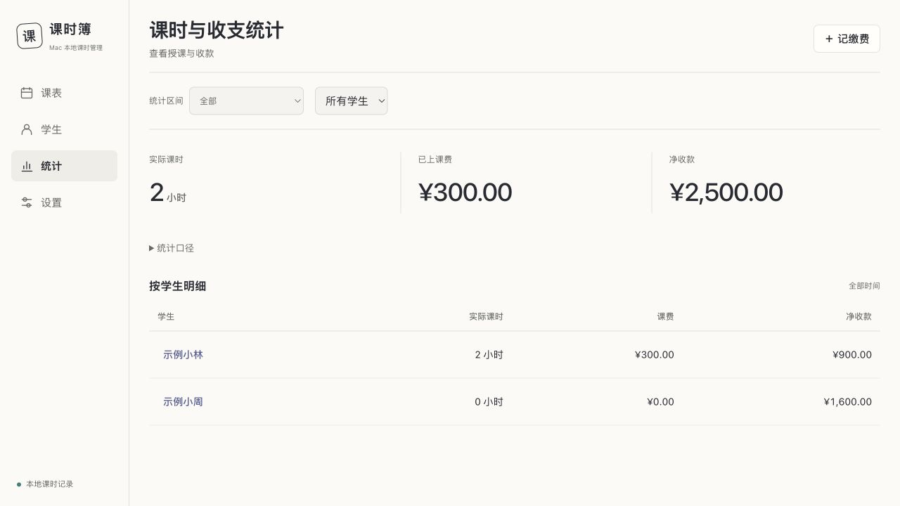

# LessonManager

Mac 本地课时与课费管理网站。以周课表、学生账目和课后确认扣费为中心，数据保存在本机 SQLite 中。

## 启动

1. 安装 Python 3.10 或更新版本。
2. 从 [最新版本](https://github.com/RongGuang233/LessonManager/releases/latest) 下载 `LessonManager-版本号.zip` 并解压。
3. 双击 `启动课时管理.command`，浏览器打开 <http://127.0.0.1:8765>。

保留终端窗口，关闭时程序停止并备份。重复启动会打开已运行的程序。升级时先停止旧程序，再从新版文件夹启动，原有账本会继续使用。

也可运行：

```sh
python3 lessonmanager.py --open
```

网页运行不需要第三方依赖、Node.js 或云端账号。

## 界面预览

以下截图全部使用虚构的学生和账目。




## 使用

- 在学生页新增学生，仅勾选实际学习的科目，并分别设置小时单价。常规课长默认每节2小时，可在学生档案中修改；余额节数按常规课长折算，临时缩短单次课程不改变折算基准。
- 默认打开“有课日”，自动记住上次使用的有课日、周或月视图。今日课程和待记课集中显示；周课表自动定位上课时段。
- 在周课表空档排课，默认使用学生的常规课长；可每周重复、复制上周、修改时间或请假。复制前默认全选，可逐节取消勾选，节数与冲突随所选课程更新；批量调课逐项预览，只同步改动过的字段，保留后续课程的单独安排。连续停课可选择日期范围或同系列后续课程，预览后统一取消，保留已上课程；请假原因可选填，批量停课统一追加原因并保留各自备注。
- 学生概览可直接“加一节课”；取消课程可“安排补课”，预填学生、科目和常规课长，原请假记录保留，显示已安排或已补课状态，并可与补课记录相互跳转；取消补课后可重新安排。既有备注不会被自动推断为关联。课程详情按待上、已上和取消状态展示相关信息。
- 点击待上课程，手动确认已上课；用 1 小时 / 2 小时快捷按钮确认实际时长，特殊价格按需展开；免费课程只记录上课，付费课程只确认一次扣一次费用，重复确认不重复收费。保存后可立即撤销本次记课。
- 家长随时缴费，全局入口继承当前学生或明确的筛选；无选中学生时先搜索选择。保存缴费后或从历史缴费详情中，可复制简短收款回执；明确标注余额截至日期及推测缴费日期，课价和课长明确时附可上课节数估算。余额允许为负。请假不扣费，撤销或更正课程后余额相应调整。
- 流水可按缴费、扣费、退款等类型筛选，课程可按状态筛选；统计金额可直接追溯同一日期范围的记录，并返回统计。
- 历史核对长依据默认折叠，推测日期明确标记；详情内编辑支持返回上层并保留未保存输入，单次调课预览时间与预计课费变化。家长对账空区间可切换到最近有记录的月份。近期流水的“查看全部”直接显示全部时间和类型。
- 学生页自动记住最近查看的学生和栏目；该学生不在当前列表时回到首位学生概览，不恢复未提交的表单。可筛选欠费、余额不足下次课费及余额待核对，详情分为概览、账户流水和课程记录，支持按日期或学期查看。
- 家长对账按日期预览，支持复制文字和打印；在浏览器打印窗口选择保存为 PDF。
- 已完成课程保留当时单价，后续调价只影响新确认的课程。
- 历史账目不完整的学生会显示“余额待核对”，不要把已记录余额当作已核实的实际结余。
- 历史核对位于“设置 → 历史资料”，有影响当前账目的待办时显示提醒；核对记录独立分页，可按学生、类别和处理状态筛选。修改缴费备注会保留未知日期；补全某项信息仅关闭相应问题，未核实账目在对账单中明确标示。
- 已结束学习且确认无欠费、无剩余预付款的学生可结清为零并归档；在读学生保留实际结余。若原表已有明确余额结转，可在“核对余额 → 按已知余额结转”记录依据，后续新账从确认结余继续计算。
- 历史余额确认保留原记录和缺失信息，不伪造缴费，不计作当日收款。之后补充这些旧明细不会再次改变新账余额；对账单将历史统计与当前结余分开说明。
- 统计支持“全部”、本周、本月、自定义或学期；空的辅助列自动隐藏，统计口径按需展开。
- 原表覆盖日期与实际学期日期分开保存。学期日期待定时显示“已录入范围”，以后在设置中逐学期填写，不假定固定学期长度。新学期也可先只填名称；日期待定时，统计和记录列表提示先设置日期或选择自定义范围。

## 数据与备份

默认数据目录为 `~/Library/Application Support/LessonManager/`，独立于代码仓库和浏览器。包含数据库和最近30份自动备份。启动时按日备份、正常退出时备份、恢复前备份；设置页可下载完整 JSON 备份，也可通过“从本机备份恢复”选择自动备份，预览记录数量后恢复。

恢复会验证备份内容，自动保存恢复前数据库，然后替换现有数据。重装程序或换浏览器不会删除数据库。

可通过 `--data-dir` 或 `LESSONMANAGER_DATA_DIR` 指定仓库之外的数据目录；通过 `--port` 指定端口。服务只监听 `127.0.0.1`。

**GitHub 仅保存程序和虚构测试数据。原表、姓名明细、数据库、导入结果和备份不提交。** 不要把原始表格放入仓库，即使仓库为私有。

## 历史 Excel 导入

解析 Excel 的可选依赖单独列于 `requirements-import.txt`，不属于网站运行依赖：

```sh
python3 -m venv .venv
.venv/bin/pip install -r requirements-import.txt
.venv/bin/python tools/import_excel.py --source-dir '/原表目录' --output '/仓库之外/导入结果.json'
python3 lessonmanager.py --import '/仓库之外/导入结果.json' --import-only
```

导入规则：学期/假期表优先于总表，同表个人明细优先于上方排班；黄色为已上且已扣费，无色为未上。保留来源位置、历史价格和特殊时长，重复课程合并，缺失信息进入核对列表。派生备份不重复导入。初次导入后需核对历史款项、结转和余额；程序不猜测未记载的缴费日期或金额。

重复载入相同编号的导入结果会保留数据库中的已有记录和后续修改。若需要用完整备份替换数据，使用设置页的恢复功能。

## 验证

```sh
python3 -m unittest discover -s tests -v
```

账务测试覆盖分科计价、负余额、补缴、单价冻结、撤销扣费、固定周课、重复复制、备份恢复及历史缺失值。Excel 测试使用临时生成的虚构表格。

运行全套测试需先安装可选的 Excel 导入依赖；前端纯函数测试可另用 `node --test web/utils.test.mjs web/workflows.test.mjs web/statement.test.mjs web/receipts.test.mjs web/history-notes.test.mjs` 运行，Node 仅用于此项开发测试。
